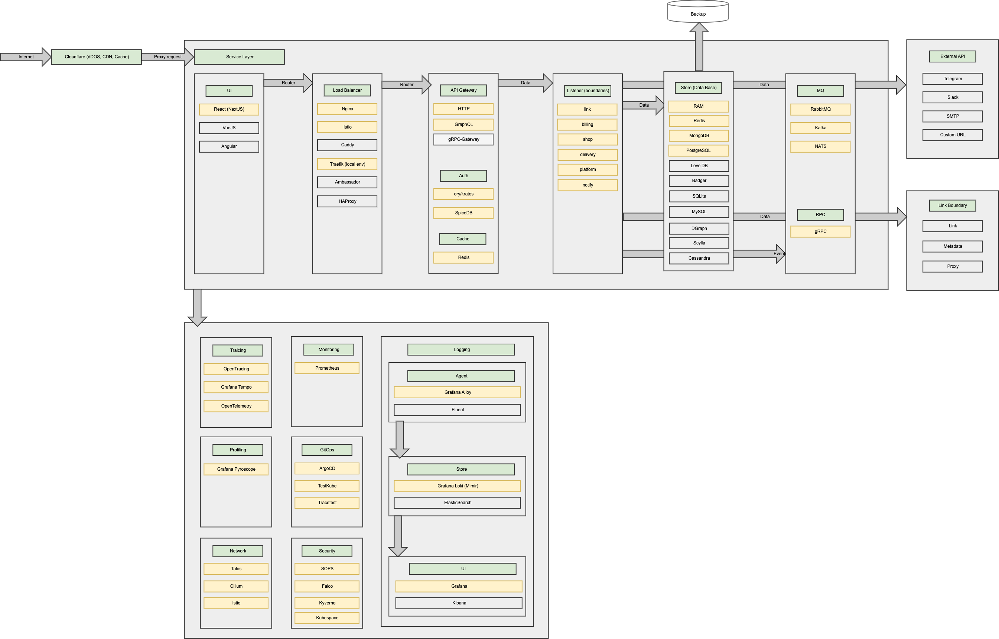

## Hi there 👋

### High Level Architecture 🚀

The project covers the entire process—from identifying Bounded Contexts to implementing microservices using
cutting-edge technologies and best practices.

_Please [star ⭐](https://github.com/shortlink-org/shortlink/stargazers) the repo if you want us to continue developing and improving ShortLink! 😀_

### Boundaries

> [!TIP]
>
> Our project follows Domain-Driven Design (DDD) principles, organizing code into distinct domains for clarity and easier updates.

| Bounded Context       | Description              | Type subdomain | Docs                                                  |
|-----------------------|--------------------------|----------------|-------------------------------------------------------|
| API Gateway           | Gateway for all services | Supporting     | [link](https://github.com/shortlink-org/shortlink)    |
| Auth Boundary         | Auth services            | Generic        | [link](https://github.com/shortlink-org/auth)         |
| Billing Boundary      | Payment services         | Generic        | [link](https://github.com/shortlink-org/billing)      |
| Chat Boundary         | Chat services            | Supporting     | [link](https://github.com/shortlink-org/chat)         |
| Delivery Boundary     | Delivery services        | Supporting     | [link](https://github.com/shortlink-org/delivery)     |
| DS Boundary           | Data Science services    | Supporting     | [link](https://github.com/shortlink-org/shortlink)    |
| Link Boundary         | Link services            | Core           | [link](https://github.com/shortlink-org/shortlink)    |
| Marketing Boundary    | Marketing services       | Supporting     | [link](https://github.com/shortlink-org/marketing)    |
| Notification Boundary | Notification services    | Generic        | [link](https://github.com/shortlink-org/notification) |
| Platform Boundary     | Platform services        | Supporting     | [link](https://github.com/shortlink-org/platform)     |
| Search Boundary       | Search services          | Supporting     | [link](https://github.com/shortlink-org/search)       |
| Shop Boundary         | Shop services            | Supporting     | [link](https://github.com/shortlink-org/shop)         |
| ShortDB Boundary      | ShortDB services         | Supporting     | [link](https://github.com/shortlink-org/shortdb)      |

##  / Recent activity 

##  / Top contributors

